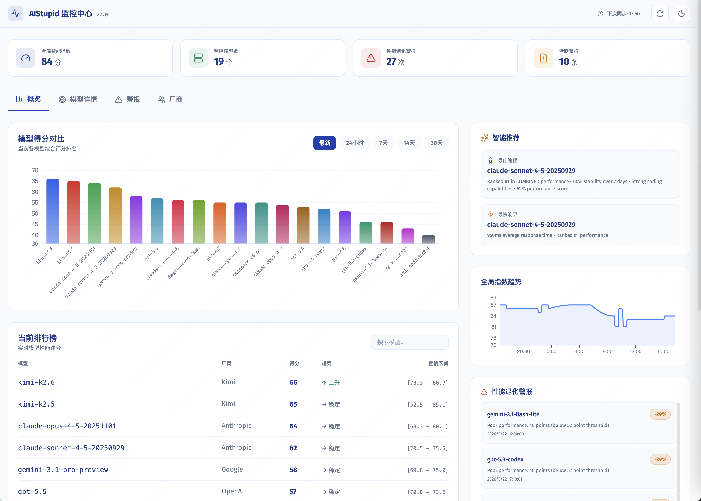
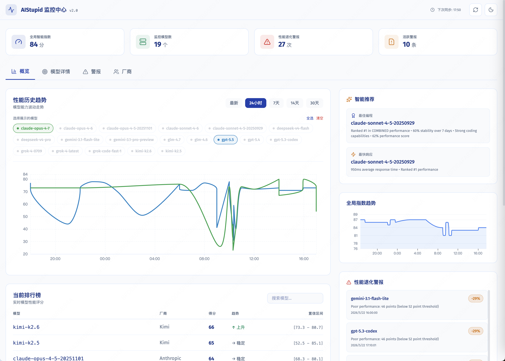
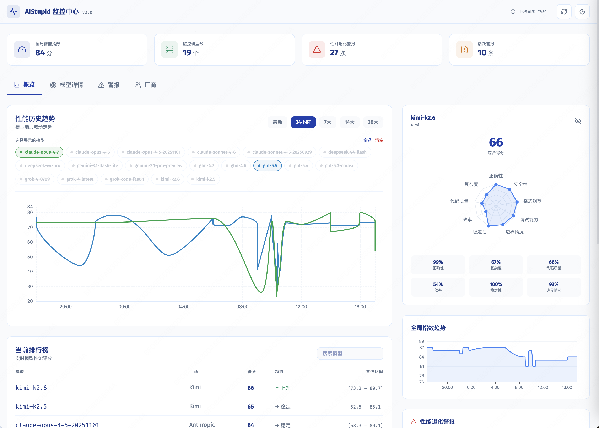
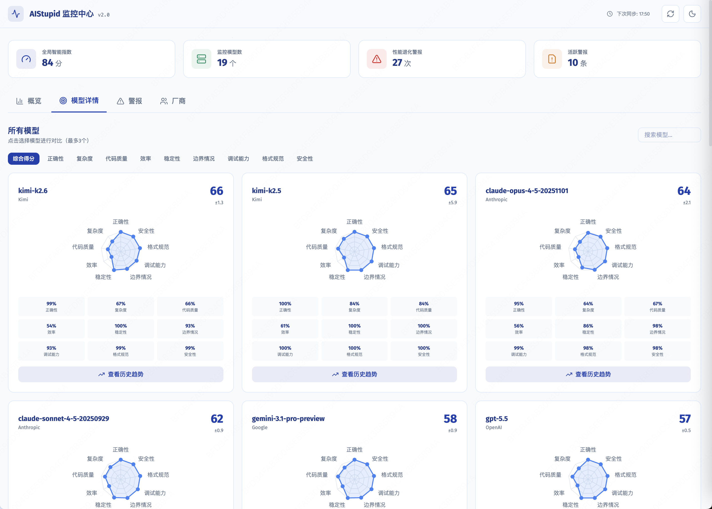
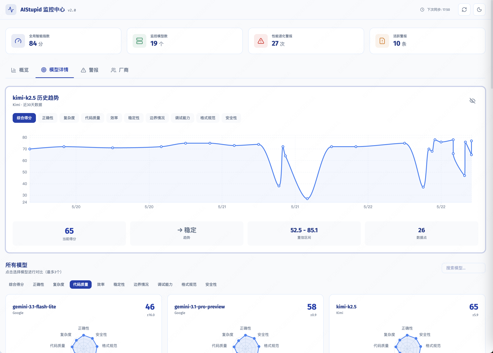
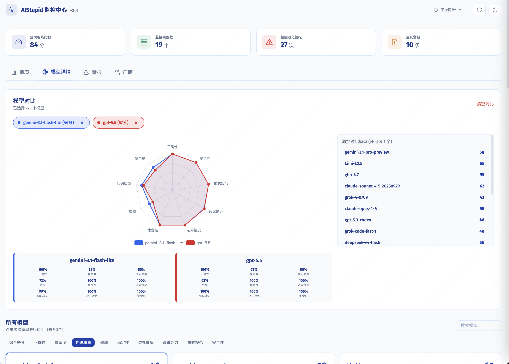
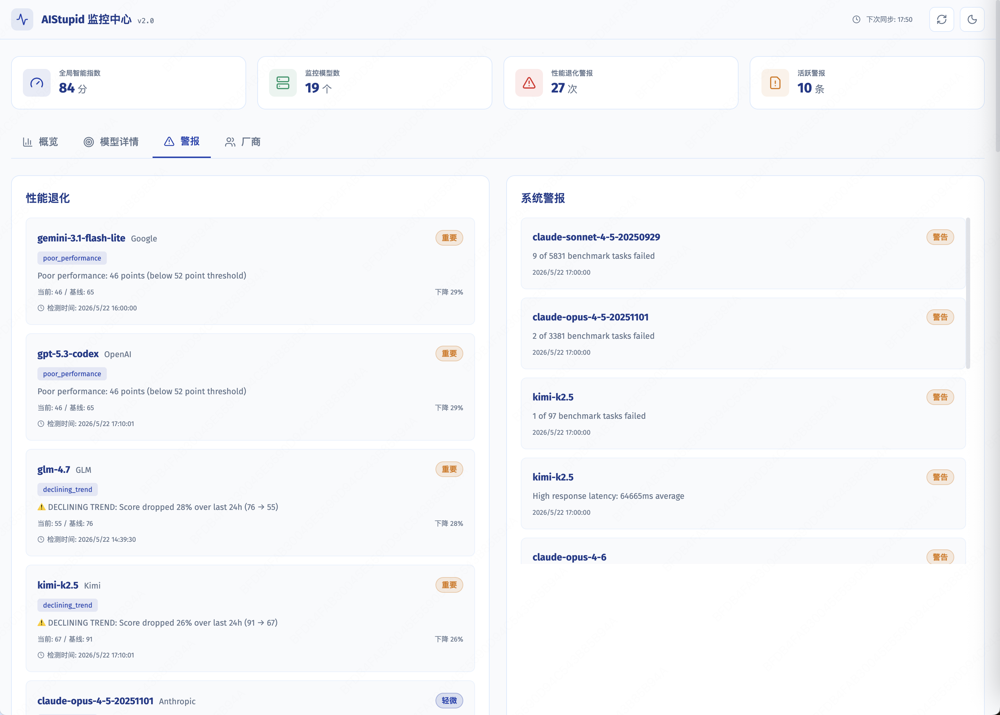
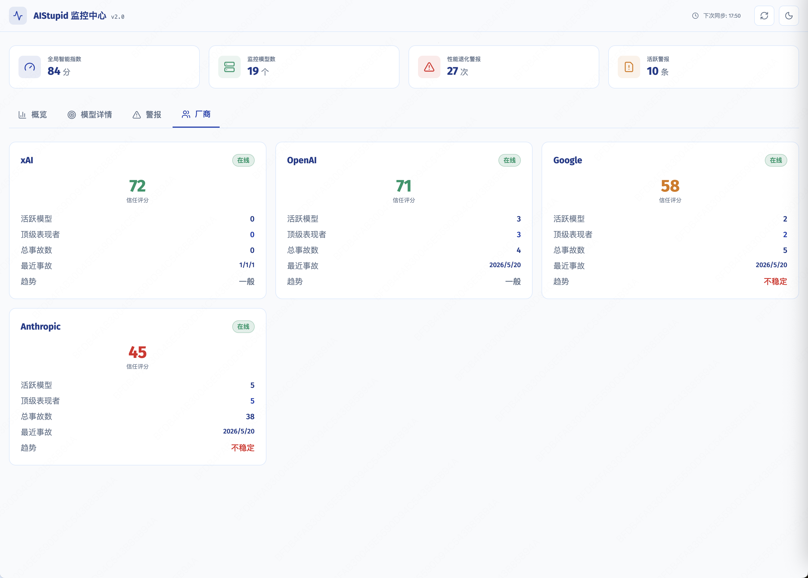
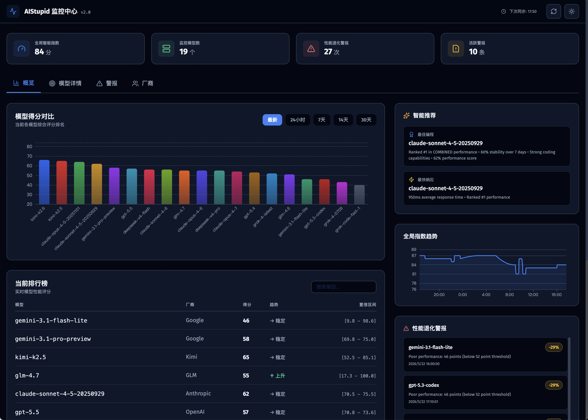
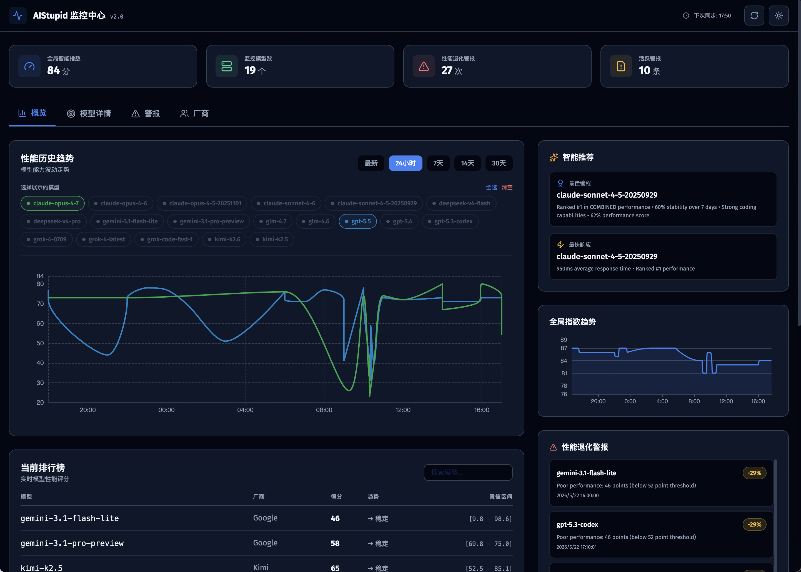

# AIStupid 监控中心

AI 模型性能监控仪表盘，实时追踪多个 AI 模型的评分变化、性能退化和可靠性指标。



## 功能

- **模型评分追踪** — 13 维度评分体系（正确性、复杂度、代码质量、效率、稳定性、边界用例、调试、格式、安全性等）
- **历史趋势图表** — 支持 24h/7d/14d/30d 时间范围，ECharts 可视化
- **性能退化告警** — 自动检测模型分数下降，按严重程度分级
- **供应商可靠性** — 按供应商聚合信任分数、事故频率、恢复时间
- **模型推荐** — 最佳代码模型、最可靠模型、最快响应模型
- **雷达图对比** — 最多 3 个模型同时对比各维度表现
- **屏蔽管理** — 可配置屏蔽特定模型不在仪表盘展示
- **手动同步** — 支持手动触发数据同步

### 历史趋势



### 排行榜与模型详情



### 全部模型详情



### 模型 10 维历史数据



### 多模型 9 维对比



### 警报



### 厂商情况



### 黑暗模式





## 技术栈

**后端**: Go + SQLite + embed（单二进制部署）

**前端**: React 19 + TypeScript + Vite + Tailwind CSS 4 + ECharts

## 快速开始

```bash
# 安装前端依赖并构建
cd frontend && npm install && npm run build && cd ..

# 编译并运行
go build -o aistupid-dashboard && ./aistupid-dashboard
```

服务启动在 `http://127.0.0.1:3223`

## 开发

```bash
# 前端开发服务器（热更新）
cd frontend && npm run dev

# 后端编译
go build -o aistupid-dashboard

# 运行测试
go test main.go db.go sync.go sync_test.go
go test main.go db.go sync.go main_test.go
go test main.go db.go sync.go integration_test.go
go test main.go db.go sync.go time_test.go
cd frontend && npm run test:run
```

## 交叉编译

单二进制部署，使用纯 Go SQLite 驱动，无需 CGO，交叉编译无额外依赖。

```bash
# 先构建前端（嵌入到二进制中）
cd frontend && npm run build && cd ..

# Linux amd64
CGO_ENABLED=0 GOOS=linux GOARCH=amd64 go build -ldflags '-s -w' -o aistupid-dashboard-linux-amd64

# Linux arm64
CGO_ENABLED=0 GOOS=linux GOARCH=arm64 go build -ldflags '-s -w' -o aistupid-dashboard-linux-arm64

# macOS arm64（Apple Silicon）
go build -o aistupid-dashboard-darwin-arm64

# macOS amd64（Intel）
GOARCH=amd64 go build -o aistupid-dashboard-darwin-amd64
```

## 数据同步

启动时自动从 `aistupidlevel.info` 拉取数据，之后每 10 分钟同步一次。超过 60 天的历史数据自动清理。

## API

所有接口返回 JSON，前缀 `/api/`：

| 端点 | 说明 |
|------|------|
| GET /api/models | 模型列表 |
| GET /api/scores | 最新评分（无参数）或历史评分（?period=7d） |
| GET /api/model/history?id=X&days=N | 单模型历史 |
| GET /api/degradations | 性能退化事件 |
| GET /api/alerts | 告警列表 |
| GET /api/global-index | 全局智能指数 |
| GET /api/provider-reliability | 供应商可靠性 |
| GET /api/recommendations | 模型推荐 |
| GET /api/transparency | 测试覆盖率和数据新鲜度 |
| GET /api/sync-status | 同步状态 |
| POST /api/sync-now | 手动触发同步 |
| GET/POST /api/config | 屏蔽模型配置 |
